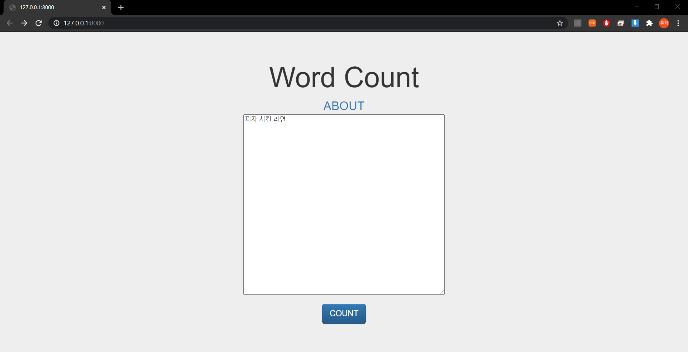
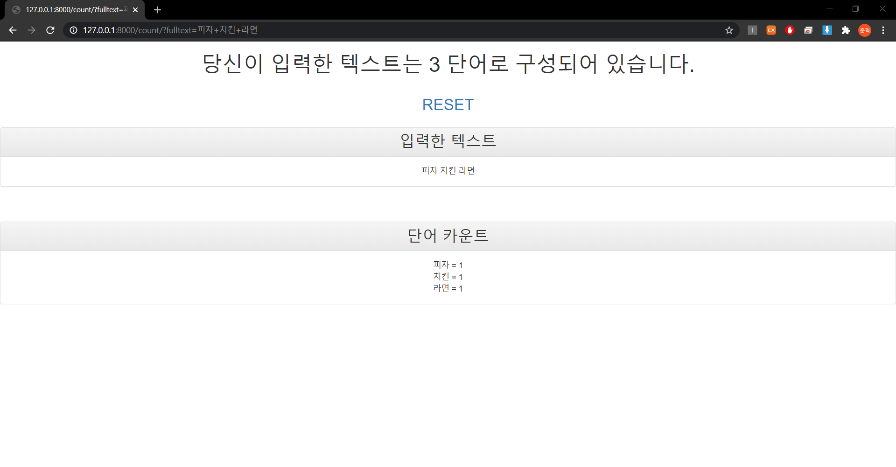

# wordcount
> 학부생 3학년 1학기 때 개발한 글자 수 세는 웹 사이트

## Installation

-

## Usage example

장고 프레임워크를 이용한 글자 수 세는 웹 사이트 개발

## Development setup

Framework: Django

## Release History

* 1.0.0
    * wordcount
    * 개발 완료

## Meta

김준혁 – wnsgur1198@naver.com

## Contributing

1. Fork it (<https://github.com/yourname/yourproject/fork>)
2. Create your feature branch (`git checkout -b feature/fooBar`)
3. Commit your changes (`git commit -am 'Add some fooBar'`)
4. Push to the branch (`git push origin feature/fooBar`)
5. Create a new Pull Request

<!-- Markdown link & img dfn's -->
